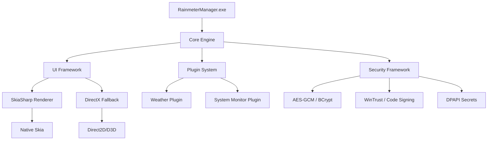

# Rainmeter Manager

An enterprise-grade management application for Rainmeter skins and widgets with advanced security features.

## Architecture

### Dependency Flow Diagram



## 🚀 **Phase 1 Complete - Security Framework Implementation**

### Dependency Flow Diagram


## 🚀 **Phase 1 Complete - Security Framework Implementation**

### Dependency Flow Diagram


## 🚀 **Phase 1 Complete - Security Framework Implementation**

✅ **WinMain Entry Point** - Enterprise-grade application bootstrap  
✅ **Security Framework** - AES-GCM encryption, code signing verification, DPAPI integration  
✅ **Build System** - Updated with security libraries (bcrypt, wintrust, crypt32)  
✅ **License Compliance** - Copyright and version information updated  
✅ **Dependencies** - Comprehensive dependency management and verification

## Prerequisites

Before building, ensure you have all required dependencies:

```powershell
# Verify all dependencies are present
.\scripts\verify_dependencies.ps1

# List all required dependencies
.\scripts\verify_dependencies.ps1 -ListOnly
```

## Build System

This project supports multiple build methods:

## Building with CMake

```bash
# Configure
cmake -S . -B build -G "Visual Studio 16 2019" -A x64

# Build Debug Configuration
cmake --build build --config Debug

# Build Release Configuration
cmake --build build --config Release

# Install (optional)
cmake --install build --config Release --prefix install
```

## Building with Visual Studio

1. Open `RainmeterManager.sln` in Visual Studio
2. Select desired configuration (Debug/Release) and platform (x64/x86)
3. Build solution (F7 or Build → Build Solution)

## Building with Batch Scripts

```bash
# For regular build
scripts/buildscript.bat

# With options
scripts/buildscript.bat --config Debug --platform x64

# CI Build
scripts/ci_build.bat --increment
```

## Debugging

### Visual Studio Debugging

1. Set RainmeterManager as the startup project
2. Select Debug configuration
3. Press F5 to start debugging

### VS Code Debugging

1. Open the project folder in VS Code
2. Select "Launch Debug (Windows)" from the debug configurations
3. Press F5 to start debugging

### Command Line Debugging

For Windows, you can use Visual Studio Developer Command Prompt:

```bash
# Build Debug
scripts/buildscript.bat --config Debug

# Debug with Visual Studio debugger
devenv /debugexe build/bin/x64/Debug/RainmeterManager.exe
```

## Debug Features

The project includes comprehensive debug utilities:

- Debug build detection
- Assert macros with message support
- Debug-only code sections
- Performance timing tools
- Memory tracking utilities

Example usage:

```cpp
#include "core/debug.h"

void SomeFunction() {
    // Times the function execution in debug builds
    MEASURE_FUNCTION;
    
    // Debug-only code
    RM_DEBUG_ONLY(
        LOG_DEBUG("This is a debug-only message");
    );
    
    // Assertions with messages
    RM_ASSERT(pointerValue != nullptr, "Expected valid pointer");
    
    // Performance measurement for blocks
    {
        MEASURE_BLOCK("Database query");
        // ... code to measure ...
    }
}
```

## Version Information

Version information is managed without affecting filenames:
- Source code: Defined in `src/version.h`
- Build: Tracked in build metadata
- Changelogs: Generated with each build

## License (Pre‑Release)

Pre‑release versions (e.g., v1.0.0-*) are licensed under the RainmeterManager Beta Non‑Commercial License (RB‑NC‑1.0). This permits free personal/internal building, testing, and evaluation, but forbids commercial use, paid distribution, or app store publication.

- Full text: see `LICENSE-BETA.txt`
- Third‑party attributions: see `NOTICE`

A future premium store release (v1.0.0 and later) will be distributed under a separate commercial EULA.

## Continuous Integration

Use the CI script for automated builds and testing:

```bash
scripts/ci_build.bat --increment --email admin@example.com
```

The CI script:
- Builds multiple configurations
- Runs tests
- Generates changelogs
- Archives build artifacts
- Maintains version history
