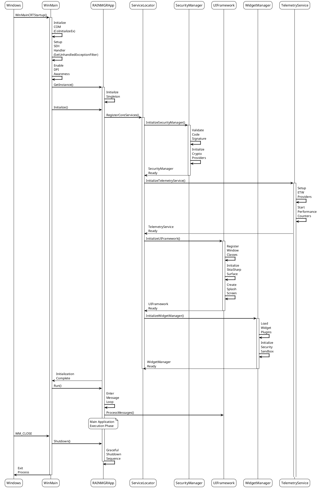
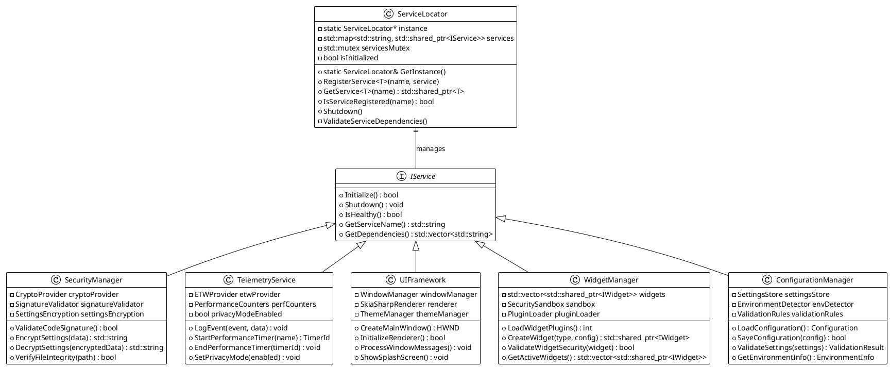
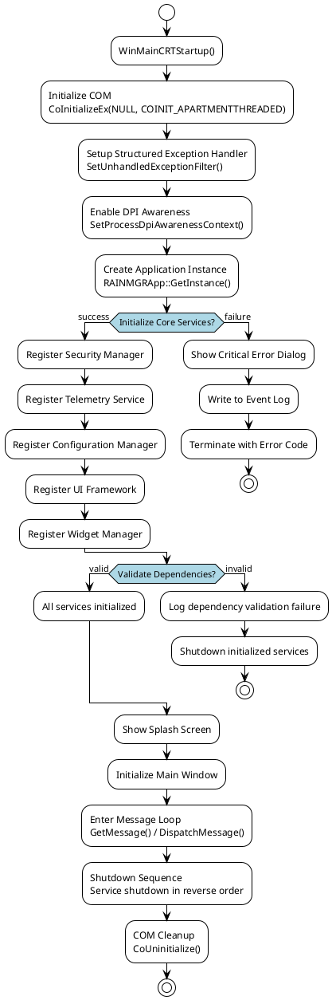
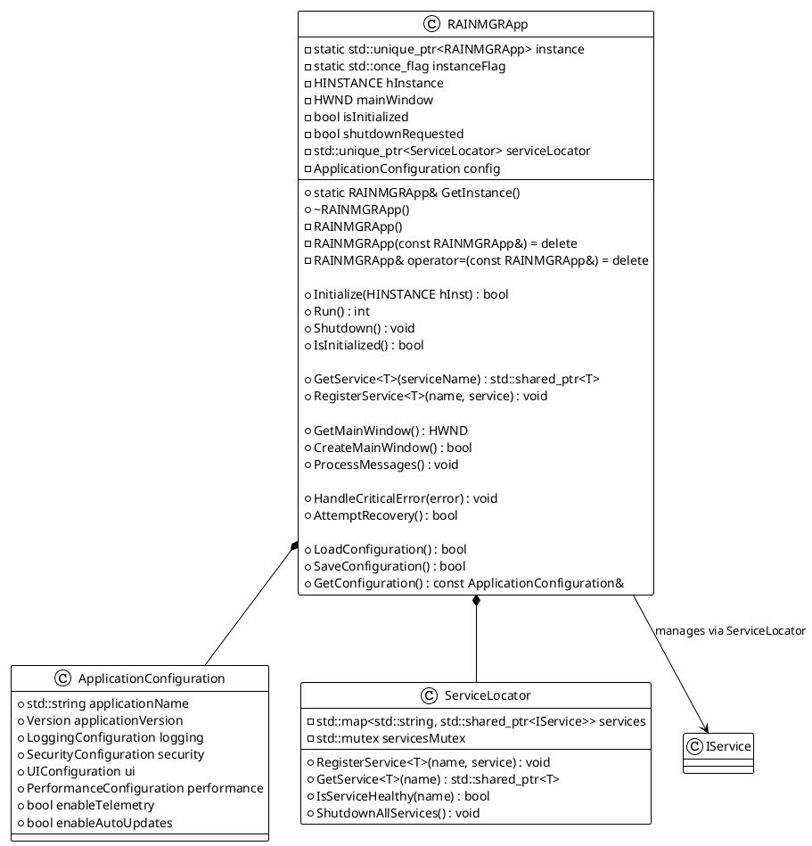
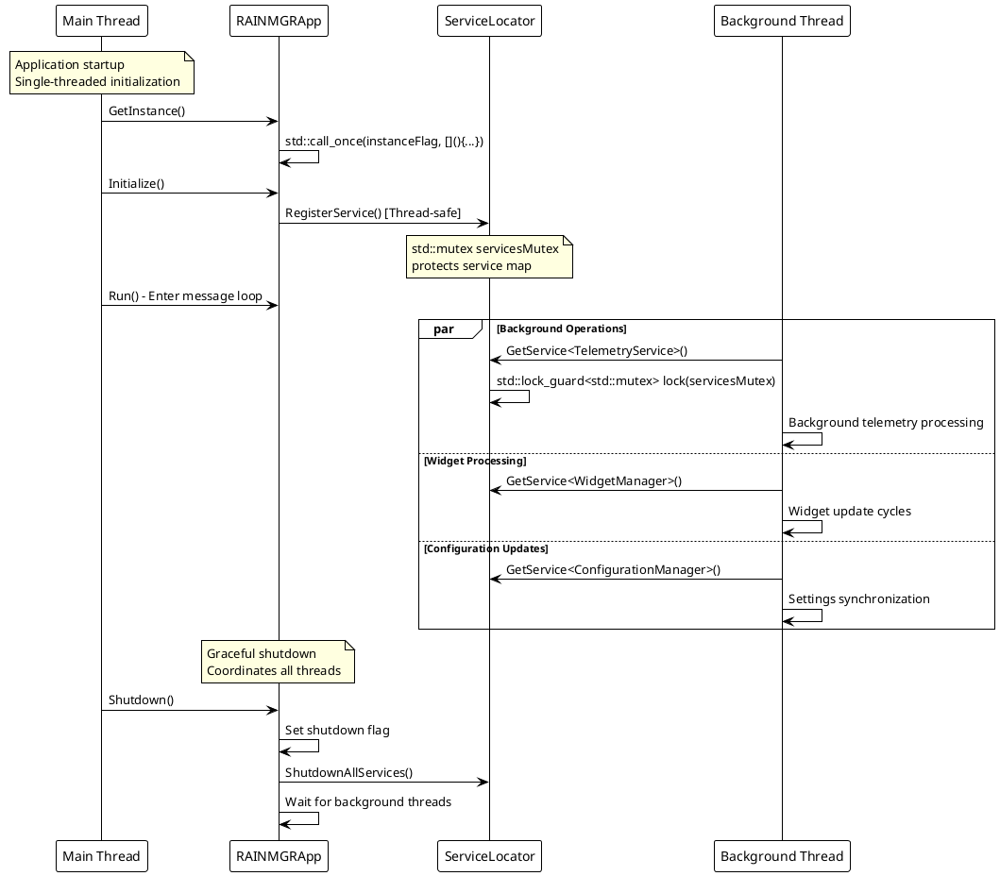
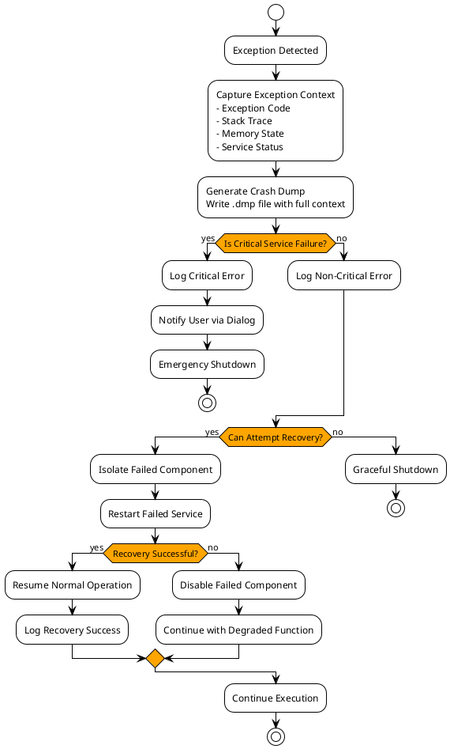
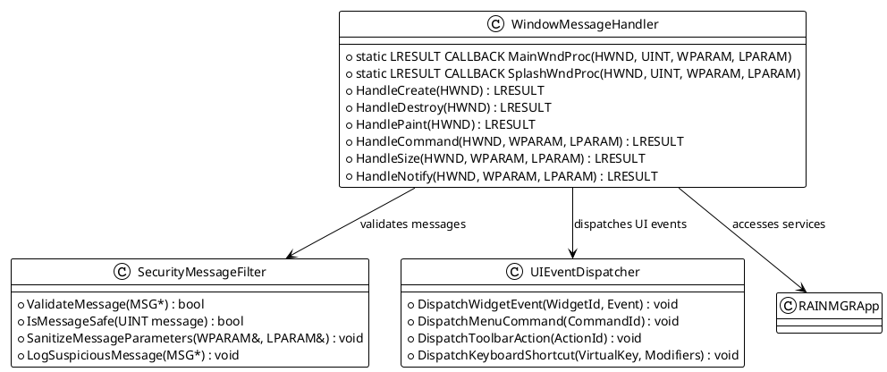
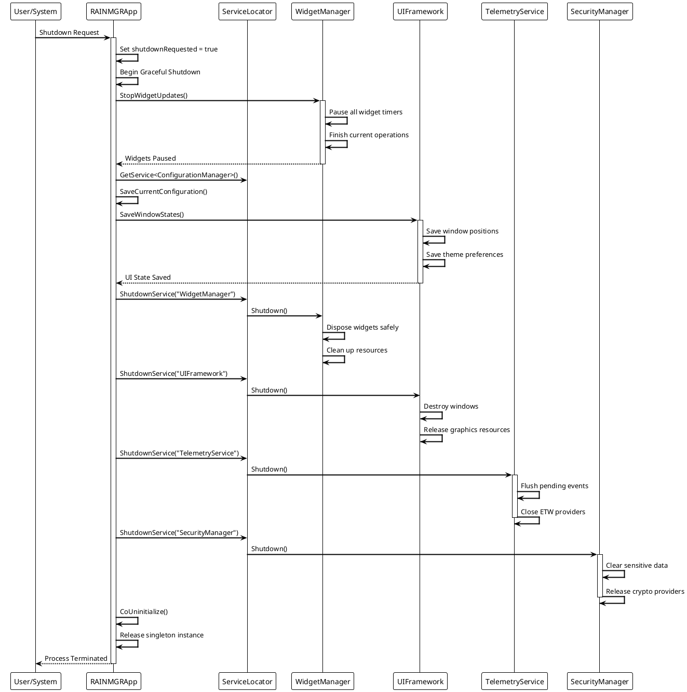
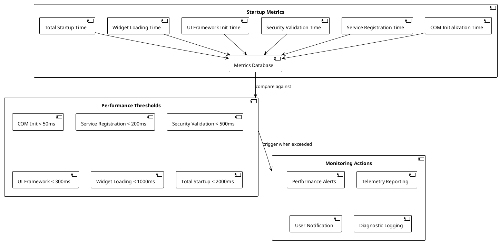
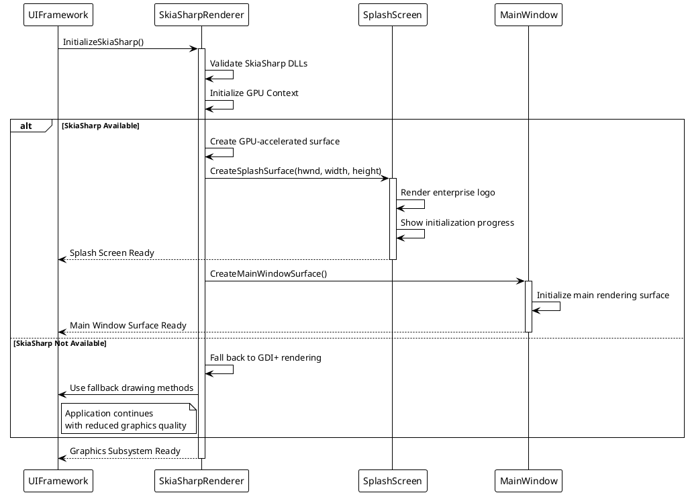

# RainmeterManager - Enterprise Application Bootstrap Design

**Document Version:** 1.0  
**Created:** August 8, 2025  
**Author:** Enterprise Development Team  
**Review Status:** Draft for Peer Review  

---

## 1. Executive Summary

This document outlines the enterprise-grade application bootstrap design for RainmeterManager, covering initialization sequences, service locator patterns, crash resilience, and graceful shutdown procedures. The design emphasizes modularity, testability, and enterprise compliance.

### 1.1 Key Design Principles
- **Fail-Fast Initialization:** Critical errors halt startup immediately
- **Service Locator Pattern:** Centralized dependency management
- **Crash Resilience:** Structured exception handling with auto-recovery
- **Graceful Degradation:** Non-critical subsystem failures don't crash the application
- **Enterprise Monitoring:** Full telemetry and audit trail

---

## 2. Application Lifecycle Architecture

### 2.1 High-Level Bootstrap Flow



### 2.2 Service Locator Architecture



---

## 3. WinMain Implementation Specification

### 3.1 WinMain Signature & Flow

```cpp
// Windows Unicode Application Entry Point
int WINAPI wWinMain(
    _In_ HINSTANCE hInstance,
    _In_opt_ HINSTANCE hPrevInstance,
    _In_ LPWSTR lpCmdLine,
    _In_ int nShowCmd
);
```

### 3.2 Initialization Sequence



---

## 4. RAINMGRApp Singleton Design

### 4.1 Class Architecture



### 4.2 Thread Safety & Concurrency



---

## 5. Error Handling & Crash Resilience

### 5.1 Structured Exception Handling (SEH)

```cpp
// Unhandled Exception Filter Implementation
LONG WINAPI RAINMGRApp::UnhandledExceptionFilter(EXCEPTION_POINTERS* exceptionInfo) {
    // 1. Capture crash context
    CrashContext context;
    context.exceptionCode = exceptionInfo->ExceptionRecord->ExceptionCode;
    context.exceptionAddress = exceptionInfo->ExceptionRecord->ExceptionAddress;
    context.threadId = GetCurrentThreadId();
    context.processId = GetCurrentProcessId();
    
    // 2. Generate crash dump
    GenerateMiniDump(exceptionInfo);
    
    // 3. Log critical error
    Logger::logCriticalError("Unhandled Exception", context);
    
    // 4. Notify telemetry service
    auto telemetry = ServiceLocator::GetInstance().GetService<TelemetryService>("Telemetry");
    if (telemetry) {
        telemetry->ReportCrash(context);
    }
    
    // 5. Show crash dialog
    ShowCrashDialog(context);
    
    // 6. Attempt graceful shutdown
    RAINMGRApp::GetInstance().EmergencyShutdown();
    
    return EXCEPTION_EXECUTE_HANDLER;
}
```

### 5.2 Recovery Mechanisms



---

## 6. Message Loop & Window Management

### 6.1 Main Message Loop Implementation

```cpp
int RAINMGRApp::Run() {
    MSG msg = {};
    BOOL bRet;
    
    // High-resolution timer for performance tracking
    auto frameTimer = Logger::startPerformanceTimer("MessageLoop");
    
    while ((bRet = GetMessage(&msg, NULL, 0, 0)) != 0) {
        if (bRet == -1) {
            // Handle GetMessage error
            HANDLE_WINDOWS_ERROR("GetMessage failed");
            break;
        }
        
        // Pre-process message for security validation
        if (!ValidateMessage(&msg)) {
            LOG_WARNING("Invalid message filtered");
            continue;
        }
        
        // Translate and dispatch message
        TranslateMessage(&msg);
        DispatchMessage(&msg);
        
        // Process service maintenance tasks
        ProcessServiceMaintenance();
        
        // Check for shutdown request
        if (shutdownRequested) {
            PostQuitMessage(0);
        }
    }
    
    Logger::endPerformanceTimer(frameTimer);
    return static_cast<int>(msg.wParam);
}
```

### 6.2 Window Procedure Architecture



---

## 7. Graceful Shutdown Procedure

### 7.1 Shutdown Sequence



### 7.2 Emergency Shutdown Procedure

```cpp
void RAINMGRApp::EmergencyShutdown() {
    // Emergency shutdown for critical failures
    Logger::logCriticalError("Emergency shutdown initiated");
    
    try {
        // Force-stop all services without waiting
        if (serviceLocator) {
            serviceLocator->EmergencyShutdown();
        }
        
        // Save critical data only
        SaveEmergencyConfiguration();
        
        // Flush logs immediately
        Logger::flushLogs();
        
    } catch (...) {
        // Suppress any exceptions during emergency shutdown
        // Write directly to system event log
        WriteToEventLog("Emergency shutdown exception");
    }
    
    // Force process termination
    TerminateProcess(GetCurrentProcess(), EMERGENCY_EXIT_CODE);
}
```

---

## 8. Performance & Monitoring Integration

### 8.1 Startup Performance Metrics



### 8.2 Health Check System

```cpp
class ApplicationHealthMonitor {
public:
    struct HealthStatus {
        bool isHealthy;
        std::chrono::milliseconds responseTime;
        std::string lastError;
        std::chrono::system_clock::time_point lastCheck;
    };
    
    // Periodic health checks
    void PerformHealthCheck() {
        auto services = serviceLocator->GetAllServices();
        
        for (const auto& [name, service] : services) {
            auto start = std::chrono::high_resolution_clock::now();
            
            bool healthy = service->IsHealthy();
            
            auto end = std::chrono::high_resolution_clock::now();
            auto responseTime = std::chrono::duration_cast<std::chrono::milliseconds>(end - start);
            
            HealthStatus status = {
                .isHealthy = healthy,
                .responseTime = responseTime,
                .lastCheck = std::chrono::system_clock::now()
            };
            
            healthStatus[name] = status;
            
            // Log unhealthy services
            if (!healthy) {
                Logger::logSecurityEvent("Service Health Check Failed", name);
            }
            
            // Alert on slow response times
            if (responseTime > std::chrono::milliseconds(1000)) {
                Logger::warning("Service response time exceeded threshold: " + name);
            }
        }
    }
    
private:
    std::map<std::string, HealthStatus> healthStatus;
    std::chrono::seconds healthCheckInterval{30};
};
```

---

## 9. SkiaSharp Integration Architecture

### 9.1 Graphics Subsystem Bootstrap



---

## 10. Implementation Checklist

### 10.1 Phase 1: Core Bootstrap (Week 1)
- [ ] **Create src/app/main.cpp** - WinMain implementation
- [ ] **Implement RAINMGRApp singleton** - Application lifecycle manager
- [ ] **ServiceLocator implementation** - Dependency injection container
- [ ] **Basic SEH setup** - Unhandled exception filter
- [ ] **COM initialization** - COM subsystem setup
- [ ] **DPI awareness** - High-DPI support

### 10.2 Phase 2: Service Integration (Week 2) 
- [ ] **SecurityManager service** - Complete security.cpp implementation
- [ ] **TelemetryService** - ETW provider setup
- [ ] **ConfigurationManager** - Settings management
- [ ] **UIFramework service** - Window management
- [ ] **WidgetManager service** - Widget lifecycle
- [ ] **Service dependency validation** - Startup verification

### 10.3 Phase 3: Error Handling (Week 3)
- [ ] **Crash dump generation** - MiniDumpWriteDump integration  
- [ ] **Recovery mechanisms** - Service restart logic
- [ ] **Emergency shutdown** - Critical failure handling
- [ ] **Health monitoring** - Service status checks
- [ ] **Performance metrics** - Startup timing

---

## 11. Review & Validation Criteria

### 11.1 Code Review Checklist
- [ ] **Thread Safety:** All singleton patterns properly implemented
- [ ] **Error Handling:** Complete SEH coverage with recovery
- [ ] **Resource Management:** RAII patterns for all resources  
- [ ] **Performance:** Startup time < 2 seconds on standard hardware
- [ ] **Security:** Code signing validation before service initialization
- [ ] **Testability:** All components mockable for unit testing

### 11.2 Integration Testing Requirements
- [ ] **Cold Startup Test:** Fresh system boot scenario
- [ ] **Crash Recovery Test:** Simulate unhandled exceptions
- [ ] **Service Failure Test:** Individual service failure scenarios  
- [ ] **Resource Exhaustion Test:** Low memory/disk space conditions
- [ ] **Network Failure Test:** Offline startup scenarios
- [ ] **Permission Failure Test:** Limited user account scenarios

---

## 12. Documentation & Maintenance

### 12.1 Architecture Documentation
- [ ] **API Documentation** - All public interfaces documented
- [ ] **Service Contracts** - Interface specifications for each service
- [ ] **Error Code Reference** - All error conditions documented  
- [ ] **Configuration Schema** - Settings file format specification
- [ ] **Deployment Guide** - Installation and configuration procedures

### 12.2 Monitoring & Diagnostics  
- [ ] **ETW Event Manifest** - Windows Event Tracing schema
- [ ] **Performance Counter Definitions** - System monitoring integration
- [ ] **Log Schema Documentation** - Structured logging format
- [ ] **Crash Analysis Procedures** - Dump file analysis workflow
- [ ] **Health Check Definitions** - Service health criteria

---

**Document Status:** Ready for Implementation  
**Next Review:** Upon Phase 1 completion  
**Implementation Priority:** CRITICAL - Blocks all other development  

This design provides the enterprise-grade foundation required for a production-ready Windows application with comprehensive error handling, monitoring, and recovery capabilities.
